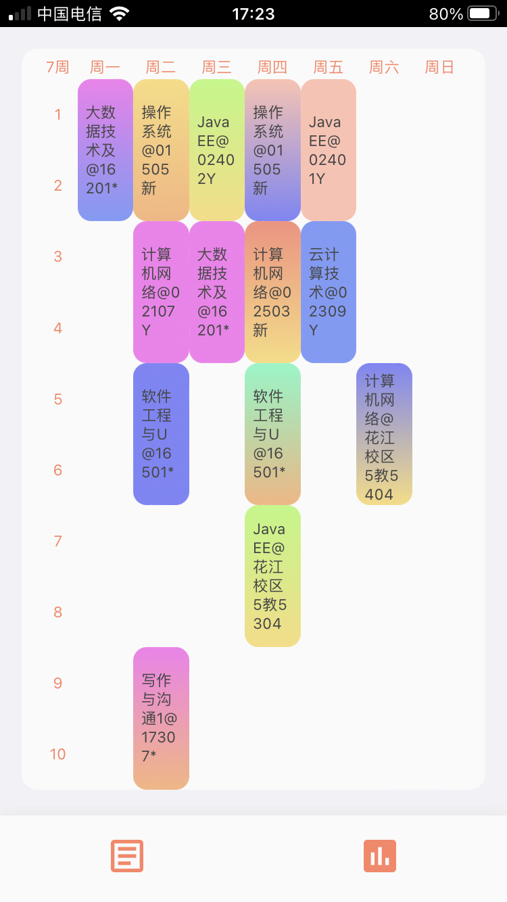
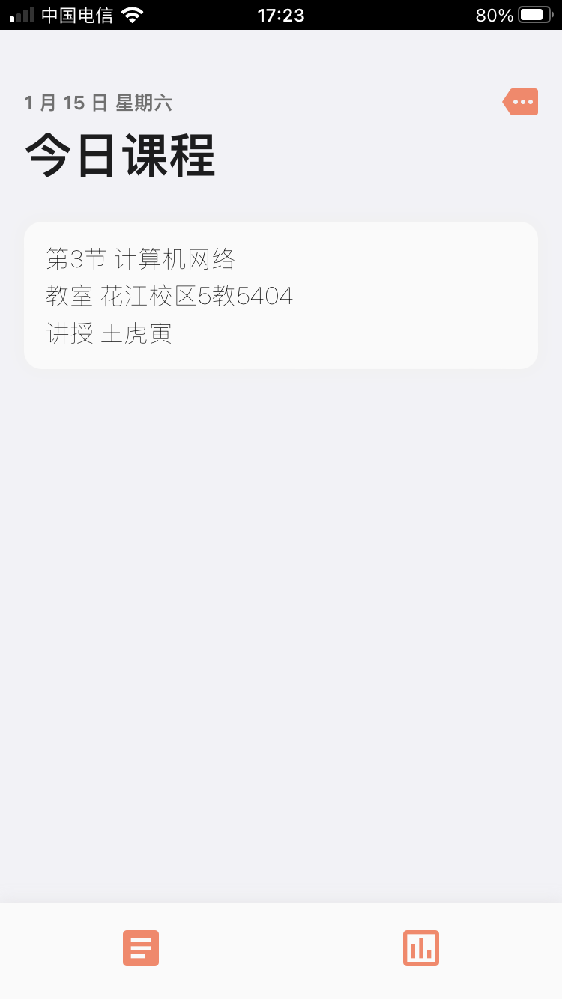
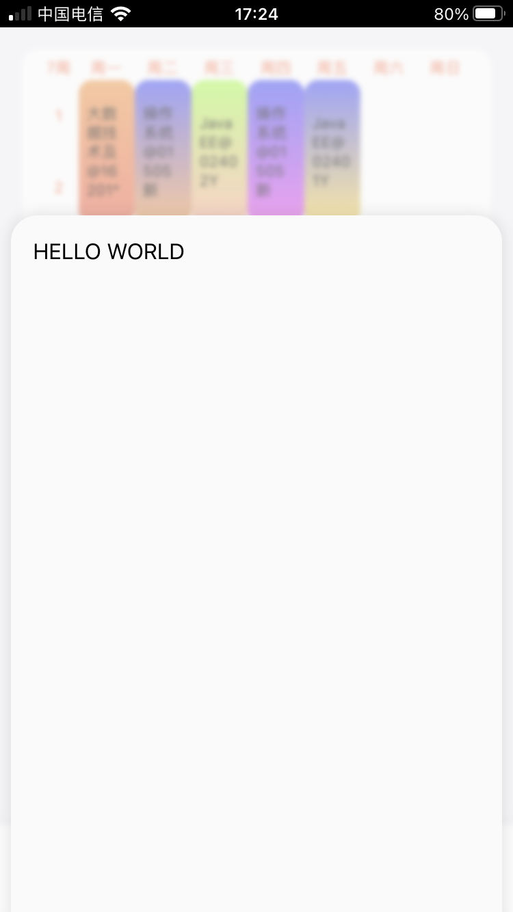
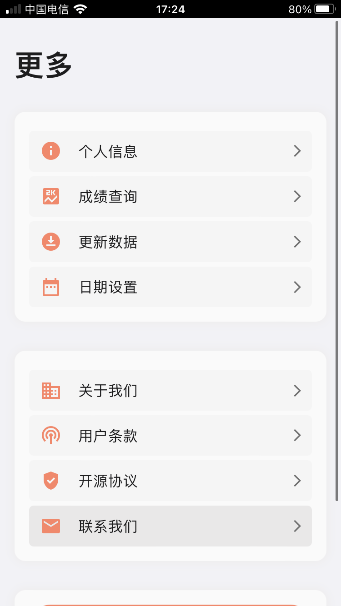
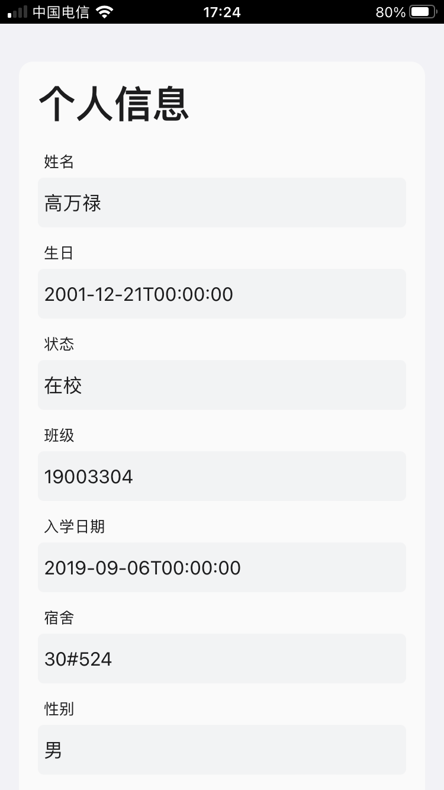
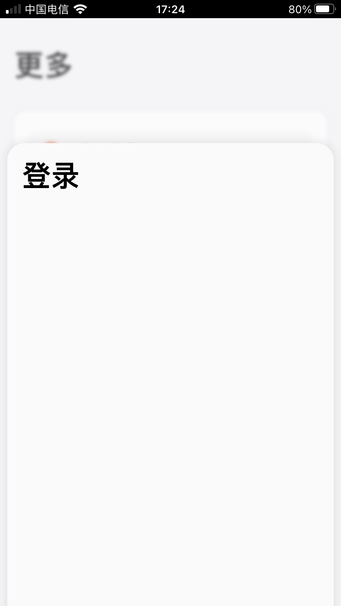

# 桂电课程表 (ios方案)  

关键词:桂电课程表\ios支持\webvpn   
技术栈:React\Node\soon...

使用前端 浏览器存储 网络代理等技术,构建简易的桂电课表应用Web方案。可使用WebVPN刷新您的数据在任何地方。

#### `iOS/iPadOS`/`Android`/`浏览器` 
本项目起因也是作者自己使用ios无处寻找、哎 那就自己写一个吧。关于ios方面，校方暂无应用支持。目前由个人开发者提供的Android版本、则ios、ipadOS使用则较为不方便。为了个人使用方便等 开发此应用。本作者没有mac、使用的`ipad Air 3`、`iPhone SE2`。如果出现界面兼容问题欢迎您提交issue或者改进它。在您的Apple设备上安装webClip下的描述文件。  \ `安卓`可能会构建webview项目  \  `网页版`后续推出  

### 桂电 WebVPN (node project)  

代理工具node项目 在 `service` 文件夹下 
本项目不不承担任何责任、使用者后果自付。  
如有侵犯您的权益请及时联系我们。   

```code
PS C:\Users\gaowanlu\Desktop\MyProject\courses\service> node "c:\Users\gaowanlu\Desktop\MyProject\courses\service\index.js"
0>>尝试初始化
wengine_vpn_ticket :5ee8c8582daaf977
show_vpn : 1
1>>TGT TGT-2113283-pmrs82xXJxfL6MpbRdS2IRa-GnjywRZ6lqu12Plkw10UVh97dUR0fhbGoCTMZU15C34-9612900499e8
2>>ST ST-2910247-TY1sF2sr-ehTMJh0OX8rTKADhRE-9612900499e8
statusCode 302
/https/77726476706e69737468656265737421e6b94689222426557a1dc7af96/wengine-vpn-token-login?token=763f8037-d031-4ba8-b33b-4c7beb4d3157
3>>token 763f8037-d031-4ba8-b33b-4c7beb4d3157
statusCode 302
/token-login?token=763f8037-d031-4ba8-b33b-4c7beb4d3157
4>>token 763f8037-d031-4ba8-b33b-4c7beb4d3157
5>> tokenlogin success
6 >> review Root over
7 >> 教务系统TGT TGT-2113284-IuhEKAfGyhky9AYaowwBh3CWy-0Tih-ALU2U8YdevreHebCLTqjW64UUMNinbkpfMpM-9612900499e8
8>>TGT TGT-2113284-IuhEKAfGyhky9AYaowwBh3CWy-0Tih-ALU2U8YdevreHebCLTqjW64UUMNinbkpfMpM-9612900499e8
9>>教务系统 ST ST-2910248-PZjGno-9In-ZxHbpJJZkj1tRRwY-9612900499e8
10>>教务系统 访问成功
11>>尝试获取数据
ST ST-2910248-PZjGno-9In-ZxHbpJJZkj1tRRwY-9612900499e8
12>>获取个人信息成功 你好 高万禄
13>>获取学期时间对照成功 2021-2022下学期
获取学期结束
14>>获取所有课程课表成功
获取课程课表结束
15>>获取费用信息成功 无欠费
16>>获取已修课程情况成功
17>>获取专业课程计划成功
18>>获取上课时间成功
19>>获取课程成绩成功
20>>获取考试安排成功
21>>获取getbk 成功
22>>根据学期 获取实验课程表成功
23>>根据学期范围 获取已修通识课成功
 
```

### WebClip运行截图  

<div align="center">








</div> 


### 服务运行  

`node ./scripts/start.js &`  

即可在3000端口发现新天地  

后续 也许会推出代理服务项目  

### 联网条约  

我们遵循从网络上获取您所需要的相关信息、不会进行修改。  

### 贡献  

如果您对此项目感兴趣、非常欢迎您进行技术交流、以及共同改进等等。为了兴趣、如果本项目对您有用 我将会很荣幸。  

### 联系我们  

地址:桂林电子科技大学 花江校区  
邮箱:heizuboriyo@gmail.com  


----
