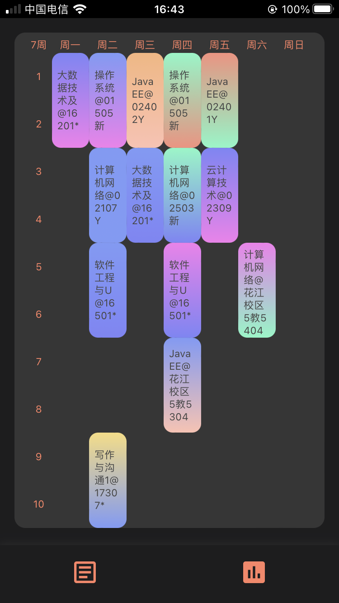
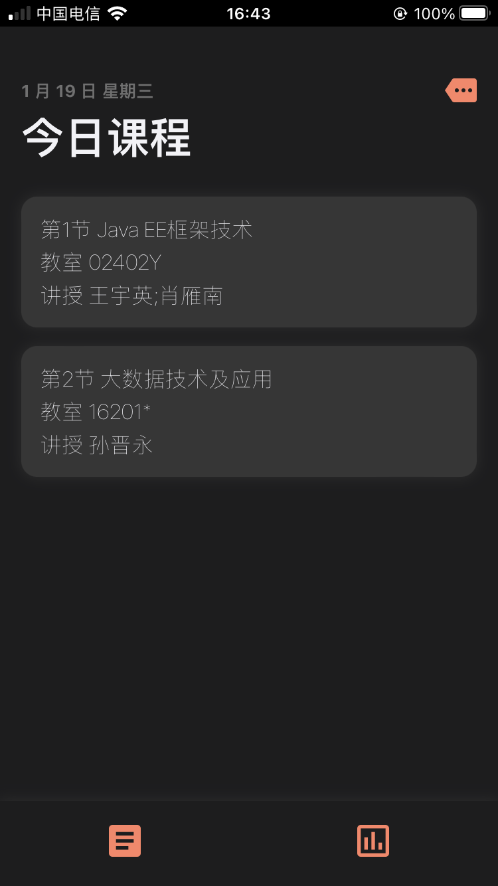
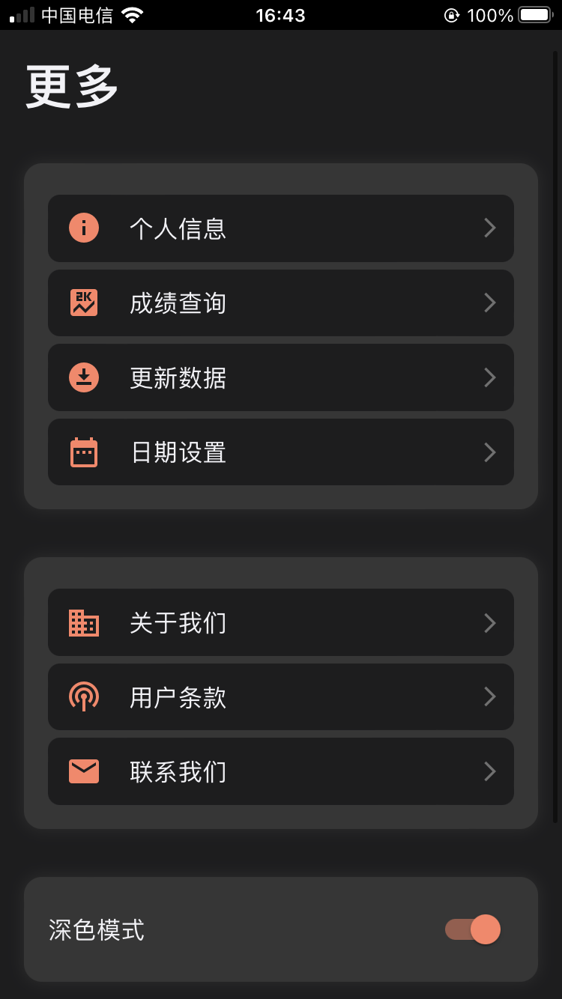
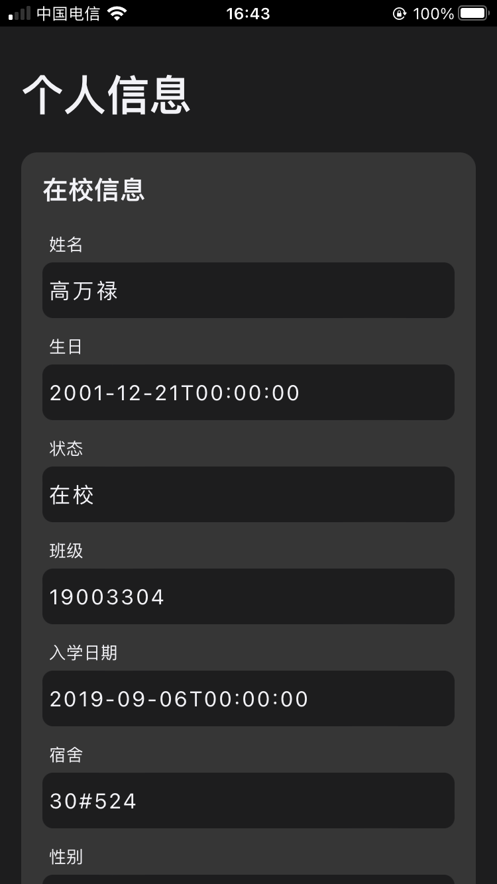
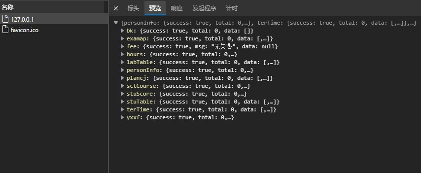

# 桂电课程表 (ios方案)   

关键词:桂电课程表\ios支持\webvpn   
技术栈:React\Node\soon...

使用前端 浏览器存储 网络代理等技术,构建简易的桂电课表应用Web方案。

### CD/CD  

Vercel  https://cours.vercel.app/  
EC2 Front-End http://linkway.site:3000/  
EC2 Proxy http://linkway.site:5557/  


### 兼容性   
本项目起因也是作者自己使用ios无处寻找、哎 那就自己写一个吧。关于ios方面，校方暂无应用支持。目前由个人开发者提供的Android版本、则ios、ipadOS使用则较为不方便。为了个人使用方便等 开发此应用。本作者没有mac、使用的`ipad Air 3`、`iPhone SE2`。如果出现界面兼容问题欢迎您提交issue或者改进它。在您的Apple设备上安装webClip下的描述文件。  \ `安卓`可能会构建webview项目  \  `网页版`后续推出  


### UI 截图  

#### 浅色模式  

<div align="center">


</div> 

#### 深色模式  

<div align="center">





</div> 

### 桂电 WebVPN Proxy Request (node project)  

代理工具node项目 在 `service` 文件夹下 
本项目不不承担任何责任、使用者后果自付。  
如有侵犯您的权益请及时联系我们。   
代理请求服务器监听端口为8080  
发起任意 GET/POST 请求 (暂无API 仅仅实验)    

```shell
$ node server.js &  
 ```  

 浏览器访问  
 ```url
 127.0.0.1:8080  
 ```

 响应  




### 服务运行  

`node ./scripts/start.js &`  

即可在3000端口发现新天地  

后续 也许会推出代理服务项目  

我们遵循从网络上获取您所需要的相关信息、不会进行修改。  

### 贡献  

如果您对此项目感兴趣、非常欢迎您进行技术交流、以及共同改进等等。为了兴趣、如果本项目对您有用 我将会很荣幸。  

### 联系我们  

地址:桂林电子科技大学 花江校区  
邮箱:heizuboriyo@gmail.com  


----
