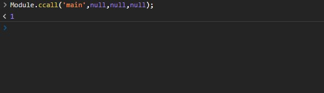
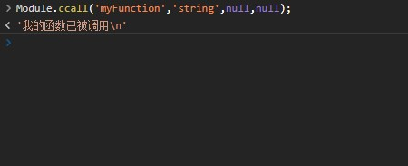
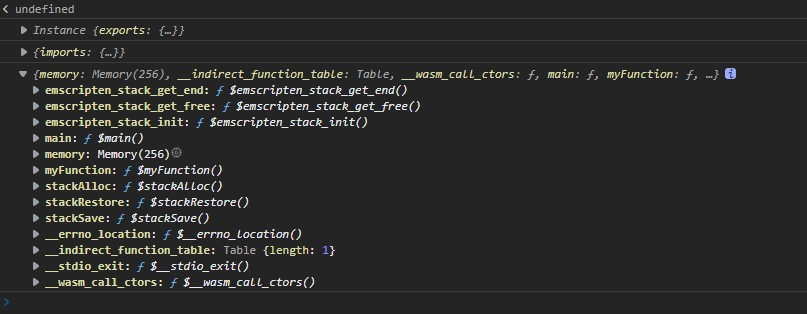

# WebAssembly  Cours to Pro

## 构建  
```shell
bash build.sh  
```


## Linux环境搭建  

```shell
git clone https://github.com/juj/emsdk.git  
cd emsdk 
./emsdk install latest  
./emsdk activate latest  
source "/SD/emsdk/emsdk_env.sh"  
echo 'source "/SD/emsdk/emsdk_env.sh"' >> $HOME/.bash_profile  
```

## 编写C++程序使用emcc构建为 wasm  
main.cpp 
```cpp
#include<stdio.h>
#include<emscripten/emscripten.h>

int main(int argc,char**argv){
        printf("HELLO WORLD");
        return 1;
}
```
shell

```shell
emcc main.cpp -s WASM=1 -o main.html -s "EXTRA_EXPORTED_RUNTIME_METHODS=['ccall']"
```
run on console   
```javascript
Module.ccall('main', // name of C function
                     null, // return type
                     null, // argument types
                     null); // arguments
```
在console调用结果  


### 导出自定义函数  
main.cpp  
```
#include<stdio.h>
#include<emscripten/emscripten.h>

int main(int argc,char**argv){
    return 0;
}
#ifdef __cplusplus
extern "C" {
#endif

char* EMSCRIPTEN_KEEPALIVE myFunction(int argc, char ** argv) {
  return "我的函数已被调用\n";
}

#ifdef __cplusplus
}
#endif
```

shell

```shell
emcc main.cpp -s WASM=1 -o main.html -s "EXTRA_EXPORTED_RUNTIME_METHODS=['ccall']"
```




## 加载和运行WebAssembly代码  

目前可以通过XMLHttpRequest 或者 Fetch API ,获取模块并放入内存，模块被初始化为带类型数组  

### 使用Fetch 进行加载  wasm  

```javascript
function loadWasm(){
    return ()=>{
        let importObject = {
            imports: {
              imported_func: function(arg) {
                console.log(arg);
              }
            }
        };
        function fetchAndInstantiate(url, importObject) {
          return fetch(url).then(response =>
            response.arrayBuffer()
          ).then(bytes =>
            WebAssembly.instantiate(bytes, importObject)
          ).then(results =>
            results.instance
          );
        }
        fetchAndInstantiate('main.wasm', importObject).then     (instance=>{
            console.log(instance);
            console.log(importObject);
            console.log(instance.exports);
        })
    }
}
loadWasm()();
```


### 使用XMLHttpRequest 加载wasm  

<https://developer.mozilla.org/zh-CN/docs/WebAssembly/Loading_and_running>  


## 缓存已编译的WebAssembly模块
可见WebAssembly模块是在client编译构建的、从wasm 到 WebAssembly实例 需要从网络获取wasm 下一步再进行构建 则需要花费时间 与 带宽 造成一定的延时  

### 使用IndexedDB进行缓存  

wasm-utils.js   
<https://github.com/mdn/webassembly-examples/blob/gh-pages/wasm-utils.js>

```html
<script src="wasm-utils.js"></script>  
<script>
    const wasmCacheVersion = 1;
    instantiateCachedURL(wasmCacheVersion, 'indexeddb-cache.wasm').then (instance =>
      console.log("Instance says the answer is: " + instance.exports.answer ())
    ).catch(err =>
      console.error("Failure to instantiate: " + err)
    );
</script>
```
instantiateCachedURL(version,url) version用于校对wasm版本用于是否更新最新的，如果版本一致且IndexedDB内存有 WebAssembly实例则在缓存中获取实例。  


## 使用WebAssembly JavaScript API
```javascript
let importObject = {
    imports: {
        imported_func: arg => console.log(arg),
    }
};
fetch('main.wasm').then(res =>
  res.arrayBuffer()
).then(bytes =>
  WebAssembly.instantiate(bytes, importObject)
).then(results => {
  results.instance.exports.exported_func();
});
```

### 内存  
WebAssembly内存为线性内存、在JavaScript中被认为可调整大小的ArrayBuffer、可以使用WebAssembly.Memory() API 申请内存。  
WebAssembly提供了一些机制使得JavaScript可以与WebAssembly底层C++运行时内存进行共享，提高一定的效率。  
```javascript
var memory = new WebAssembly.Memory({initial:10, maximum:100});
```
一个页面64KB 初始化为10个页面 640KB 最大为100个页面 6.4MB
```javascript
new Uint32Array(memory.buffer)[0] = 42;
```
```javascript
new Uint32Array(memory.buffer)[0]
```
可以通过memory.grow(pageSize) 增加内存  
pageSize为要增加 WebAssembly pages 页数  

之外还有 WebAssembly.Table 
```
var table = new WebAssembly.Table({ element: "anyfunc", initial: 1, maximum: 10 });
```

## 导出的WebAssembly函数


## 理解WebAssembly文本格式

## 将WebAssembly文本格式转换为wasm
